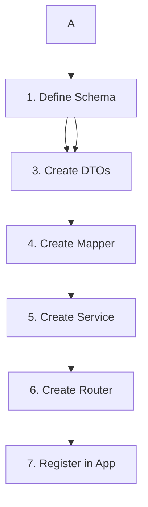

# LabLink - Feature Creation Flow

> **Guía completa para implementar nuevos módulos/features en LabLink**
> Basada en la arquitectura modular con TypeScript + Express + Drizzle ORM

---

## 🎯 Objetivo

Esta documentación define el **orden exacto y las mejores prácticas** para crear nuevos módulos en LabLink, siguiendo la arquitectura de capas establecida.

## 📋 B. Module Creation Flow (1-7)

### **Secuencia de Implementación Obligatoria**



---

## 🔧 Pasos Detallados

### **1-7: Define Schema First** 📊
- **Archivo**: `src/infra/db/schema/[module].ts`
- **Propósito**: Definir estructura de base de datos
- **Incluye**:
  - Tablas con tipos TypeScript
  - Relaciones foreign keys
  - Índices y constraintas
  - Enums si es necesario

```typescript
// Ejemplo: src/infra/db/schema/users.ts
export const users = pgTable('users', {
  id: uuid('id').primaryKey().defaultRandom(),
  email: varchar('email', { length: 255 }).notNull().unique(),
  // ... más campos
});
```

### **2-7: Create Repository** 🗃️
- **Archivo**: `src/modules/[module]/[module].repo.ts`
- **Propósito**: Acceso a datos con Drizzle ORM
- **Incluye**:
  - Operaciones CRUD básicas
  - Queries específicas del dominio
  - Manejo de transacciones

```typescript
// Ejemplo: src/modules/users/users.repo.ts
export class UsersRepository {
  async findById(id: string): Promise<User | null> {
    // Implementación con Drizzle
  }
}
```

### **3-7: Create DTOs** 📝
- **Archivo**: `src/modules/[module]/[module].dtos.ts`
- **Propósito**: Tipos de entrada y salida de API
- **Incluye**:
  - Request DTOs (CreateUserDto, UpdateUserDto)
  - Response DTOs (UserResponseDto)
  - Validación con Zod schemas

```typescript
// Ejemplo: src/modules/users/users.dtos.ts
export const CreateUserDto = z.object({
  email: z.string().email(),
  name: z.string().min(2).max(100),
});

export type CreateUserDto = z.infer<typeof CreateUserDto>;
```

### **4-7: Create Mapper** 🔄
- **Archivo**: `src/modules/[module]/[module].mapper.ts`
- **Propósito**: Transformar entre modelos de DB y DTOs
- **Incluye**:
  - DB entity → Response DTO
  - Request DTO → DB entity
  - Manejo de campos sensibles (passwords, etc.)

```typescript
// Ejemplo: src/modules/users/users.mapper.ts
export class UsersMapper {
  static toResponseDto(user: User): UserResponseDto {
    return {
      id: user.id,
      email: user.email,
      // No incluir password
    };
  }
}
```

### **5-7: Create Service** 🧠
- **Archivo**: `src/modules/[module]/[module].service.ts`
- **Propósito**: Lógica de negocio y orchestración
- **Incluye**:
  - Validaciones de negocio
  - Coordinación entre repositories
  - Manejo de errores de dominio

```typescript
// Ejemplo: src/modules/users/users.service.ts
export class UsersService {
  constructor(private usersRepo: UsersRepository) {}

  async createUser(dto: CreateUserDto): Promise<UserResponseDto> {
    // Lógica de negocio
  }
}
```

### **6-7: Create Router** 🛣️
- **Archivo**: `src/modules/[module]/[module].router.ts`
- **Propósito**: Endpoints HTTP y middleware
- **Incluye**:
  - Rutas REST (GET, POST, PUT, DELETE)
  - Validación de requests
  - Manejo de responses y errores HTTP

```typescript
// Ejemplo: src/modules/users/users.router.ts
export const usersRouter = Router();

usersRouter.post('/', validateBody(CreateUserDto), async (req, res) => {
  // Implementación del endpoint
});
```

### **7-7: Register Router in App** 🔗
- **Archivo**: `src/app.ts`
- **Propósito**: Integrar el módulo en la aplicación
- **Incluye**:
  - Registro de rutas
  - Prefijos de URL
  - Middleware específico del módulo

```typescript
// Ejemplo: src/app.ts
import { usersRouter } from './modules/users/users.router.js';

app.use('/api/users', usersRouter);
```

---

## 🏗️ Arquitectura de Capas

### **Flujo de Datos**
```
HTTP Request → Router → Service → Repository → Database
            ↓         ↓        ↓
           DTOs   →  Mapper  → Schema
```

### **Separación de Responsabilidades**
- **Router**: HTTP, validación, serialización
- **Service**: Lógica de negocio, coordinación
- **Repository**: Acceso a datos, queries
- **DTOs**: Contratos de API
- **Mapper**: Transformación de datos
- **Schema**: Estructura de base de datos

---

## ✅ Checklist de Implementación

### Antes de empezar:
- [ ] Definir requisitos del módulo
- [ ] Diseñar estructura de datos
- [ ] Planificar endpoints necesarios

### Durante implementación:
- [ ] **Paso 1**: Schema definido y migración creada
- [ ] **Paso 2**: Repository con operaciones básicas
- [ ] **Paso 3**: DTOs con validación Zod
- [ ] **Paso 4**: Mapper bidireccional
- [ ] **Paso 5**: Service con lógica de negocio
- [ ] **Paso 6**: Router con todos los endpoints
- [ ] **Paso 7**: Integración en app principal

### Después de implementar:
- [ ] Tests unitarios para service y repository
- [ ] Tests E2E para endpoints
- [ ] Documentación OpenAPI actualizada
- [ ] Verificar que `pnpm check` pasa

---

## 🎨 Convenciones de Naming

### **Archivos**
- `[module].schema.ts` - Schema de base de datos
- `[module].repo.ts` - Repository
- `[module].dtos.ts` - DTOs y validaciones
- `[module].mapper.ts` - Transformaciones
- `[module].service.ts` - Lógica de negocio
- `[module].router.ts` - Endpoints HTTP

### **Base de Datos vs TypeScript**
- **DB**: `snake_case` (user_id, created_at)
- **TypeScript**: `camelCase` (userId, createdAt)
- **Mapper**: Convierte entre ambos formatos

### **URLs**
- Usar plural: `/api/users`, `/api/laboratories`
- RESTful: GET, POST, PUT, DELETE
- Parámetros: `/api/users/:id`

---

## 🔍 Ejemplos de Referencia

### **Módulos Implementados**
- **Auth Module**: `src/modules/auth/` - Autenticación JWT
- **Users Module**: `src/modules/users/` - Gestión de usuarios
- **Health Module**: `src/modules/health/` - Health check simple

### **Patrones Comunes**
- Inyección de dependencias en constructores
- Manejo de errores con custom exceptions
- Respuestas HTTP consistentes
- Validación en múltiples capas

---

## 🚀 Comandos Útiles

```bash
# Desarrollo
pnpm dev                 # Servidor con hot reload
pnpm check              # Format + lint + typecheck

# Base de datos
pnpm db:gen             # Generar migraciones
pnpm db:migrate         # Aplicar migraciones
pnpm db:studio          # GUI de base de datos

# Testing
pnpm test               # Tests unitarios
pnpm test:watch         # Tests en modo watch
```

---

## 📚 Referencias

- **Drizzle ORM**: [Documentación oficial](https://orm.drizzle.team/)
- **Zod Validation**: [Schema validation](https://zod.dev/)
- **Express.js**: [Routing guide](https://expressjs.com/en/guide/routing.html)
- **TypeScript**: [Best practices](https://www.typescriptlang.org/docs/)

---

> **Nota**: Este flow debe seguirse **secuencialmente** para mantener la consistencia y evitar dependencias rotas. Cada paso construye sobre el anterior.

---
*Documentación creada para LabLink - Laboratory Management System*
*Última actualización: 16 de Noviembre, 2025*
