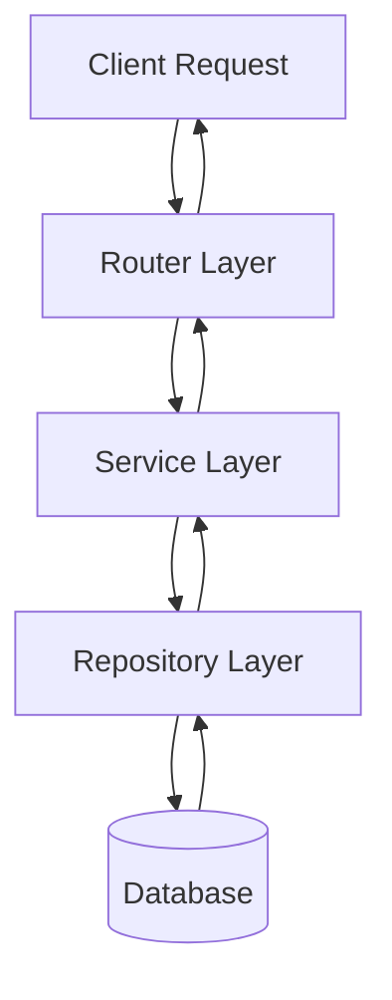

# 🗺️ LabLink Project Map

## 📁 Project Structure
```
LabLink-node/
├── 📄 src/
│   ├── 🌐 modules/          # Business modules
│   │   ├── auth/           # [[Authentication Module]]
│   │   ├── users/          # [[Users Module]]
│   │   └── health/         # [[Health Check Module]]
│   ├── 🏗️ infra/           # Infrastructure layer
│   │   ├── db/            # [[Database Layer]]
│   │   └── http/          # [[HTTP Client]]
│   ├── ⚙️ config/          # [[Configuration]]
│   └── 🔧 common/          # [[Common Utilities]]
├── 📚 docs/               # [[Documentation]]
├── 🗃️ drizzle/            # [[Database Migrations]]
└── 🧪 tests/              # [[Testing Structure]]
```

## 🏗️ Architecture Layers

### Presentation Layer (Routes)
- **Purpose**: Handle HTTP requests/responses
- **Files**: `*.router.ts`
- **Responsibilities**:
  - Request validation
  - Response formatting
  - Middleware application
- **Study Notes**: [[Router Layer Analysis]]

### Business Logic Layer (Services)
- **Purpose**: Core business logic
- **Files**: `*.service.ts`
- **Responsibilities**:
  - Business rules
  - Data validation
  - Orchestration
- **Study Notes**: [[Service Layer Analysis]]

### Data Access Layer (Repositories)
- **Purpose**: Database operations
- **Files**: `*.repo.ts`
- **Responsibilities**:
  - SQL queries
  - Data mapping
  - Transaction handling
- **Study Notes**: [[Repository Layer Analysis]]

### Infrastructure Layer
- **Purpose**: External dependencies
- **Files**: `infra/*`
- **Responsibilities**:
  - Database connections
  - HTTP clients
  - Configuration
- **Study Notes**: [[Infrastructure Analysis]]

## 🔄 Data Flow



## 📊 Technology Stack

### Backend Core
- **Runtime**: [[Node.js Learning]]
- **Language**: [[TypeScript Learning]]
- **Framework**: [[Express.js Learning]]
- **ORM**: [[Drizzle ORM Learning]]

### Database
- **DBMS**: [[PostgreSQL Learning]]
- **Migration Tool**: [[Drizzle Kit Learning]]
- **GUI**: [[Drizzle Studio Learning]]

### Development Tools
- **Package Manager**: [[pnpm Learning]]
- **Code Quality**: [[Biome Learning]]
- **Testing**: [[Vitest Learning]]

## 🎯 Learning Paths

### Beginner Path
1. [[Project Overview]] - Understand what LabLink does
2. [[Quick Start Guide]] - Get it running locally
3. [[Basic Architecture]] - Understand the layers
4. [[Simple CRUD]] - Analyze users module

### Intermediate Path
1. [[Authentication Deep Dive]] - JWT implementation
2. [[Database Design]] - Schema and relationships
3. [[API Design]] - RESTful patterns
4. [[Error Handling]] - Custom error classes

### Advanced Path
1. [[Performance Optimization]] - Query optimization
2. [[Security Patterns]] - Auth middleware
3. [[Testing Strategies]] - Unit and E2E tests
4. [[Deployment]] - Production considerations

## 📚 Study Sessions
- [[Learning Session 1]] - Project setup and overview
- [[Learning Session 2]] - Architecture analysis
- [[Learning Session 3]] - Database deep dive
- [[Learning Session 4]] - Authentication system

---
## 🔗 Quick Links
- [GitHub Repo](https://github.com/Anieto86/LabLink-node)
- [Live Documentation](https://anieto86.github.io/LabLink-node/)
- [[LabLink - Quick Reference]]
