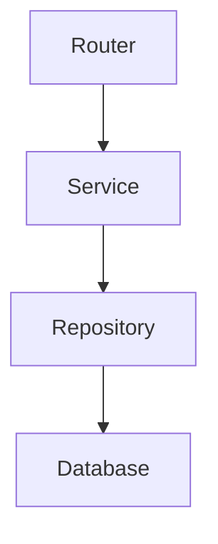

# 📚 LabLink Learning Session {{session-number}}

## 🎯 Today's Goals
- [ ]
- [ ]
- [ ]

## 📖 Topics Covered

### Architecture Deep Dive
**Focus**:
**Files Analyzed**:
**Key Learnings**:

### Code Implementation
**Feature**:
**Implementation**:
**Patterns Used**:

### Database Schema
**Tables Studied**:
**Relationships**:
**Queries Practiced**:

## 💡 Key Insights

### What Clicked Today
1.
2.
3.

### Aha Moments
-

### Best Practices Learned
-

## 🔗 Code Connections Made


## 🧪 Hands-On Practice

### Code I Modified
```typescript
// Paste code snippets here
```

### Tests I Ran
- [ ]
- [ ]

### Experiments
- [ ]
- [ ]

## 🤔 Questions for Next Session
1.
2.
3.

## 📋 Next Session Prep
- [ ] Review:
- [ ] Practice:
- [ ] Research:

---
## 🔗 Related Notes
- [[Previous Session]]
- [[Next Session]]
- [[LabLink - Overview]]
