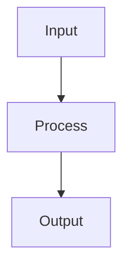

# 🕵️ Reverse Engineering: {{component-name}}

## 🎯 Discovery Mission
**Goal**: Understand {{component}} without reading docs first

## 🔍 Initial Observations
**File Size**:
**Imports**:
**Exports**:
**First Impression**:

## 🧩 Code Structure Analysis

### Functions/Methods Found
```typescript
// List all functions/methods and guess what they do
function createUser() {} // Probably creates a user?
function validateEmail() {} // Validates email format?
```

### Dependencies Discovered
- `drizzle-orm` → Database operations
- `zod` → Data validation
- `bcrypt` → Password hashing
- Custom imports:

## 🔬 Hypothesis Formation

### What I Think This Does
1.
2.
3.

### How I Think It Works


### Why I Think It's Designed This Way
-
-
-

## 🧪 Testing My Hypothesis

### Experiment 1: Run It
```bash
# Commands to test this component
```
**Result**:
**Correct?**: ✅/❌

### Experiment 2: Break It
```typescript
// Modify the code to see what breaks
```
**What broke**:
**What I learned**:

### Experiment 3: Trace Execution
```bash
# Add console.logs and run again
```
**Execution path**:
**Surprises**:

## 📚 Validation Against Docs
**After my analysis, what do the docs say?**

### What I Got Right
-
-

### What I Missed
-
-

### What Surprised Me
-
-

## 💡 Deep Understanding Gained

### Core Concepts
1. **{{Concept 1}}**:
2. **{{Concept 2}}**:
3. **{{Concept 3}}**:

### Design Patterns Identified
- **Pattern**: {{Pattern Name}}
  - **Where**:
  - **Why**:
  - **Alternative**:

### Best Practices Observed
-
-
-

## 🔗 Connections Made
- Similar to: [[Other Component]]
- Uses pattern from: [[Design Pattern]]
- Relates to: [[Related Concept]]

## 🎯 Next Investigation
- [ ] How does this connect to {{Related Component}}?
- [ ] What happens if {{Scenario}}?
- [ ] How would I implement {{Similar Feature}}?
